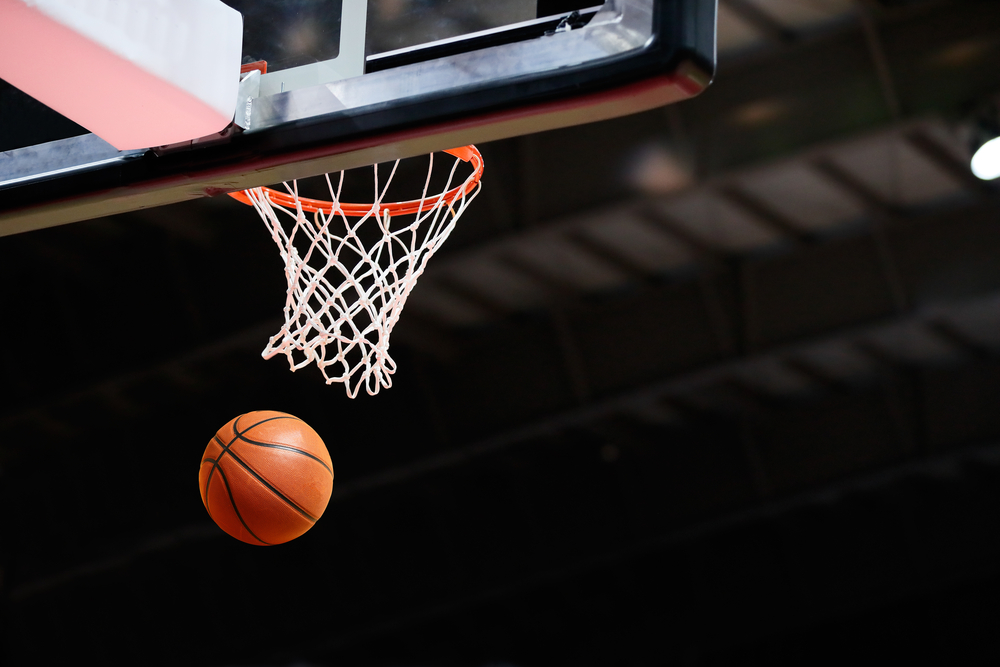
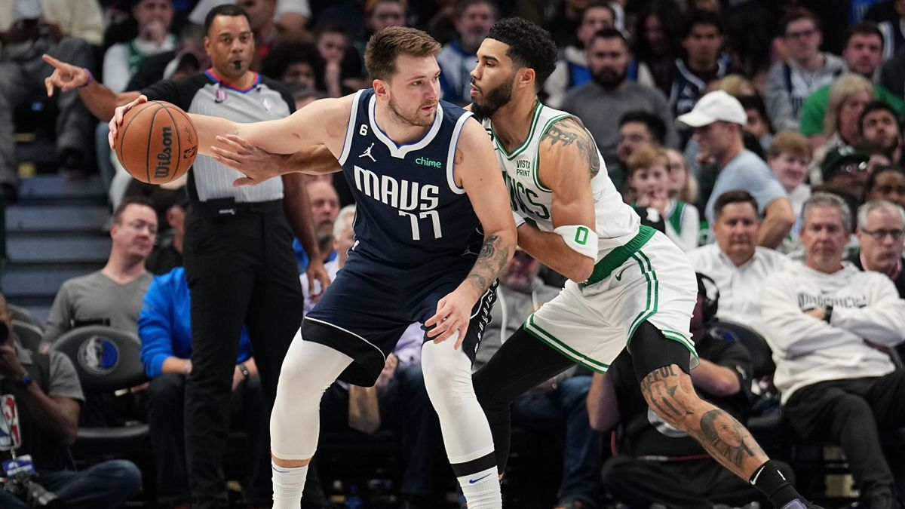

<!DOCTYPE html>
<html lang="en">
<head>
  <meta charset="UTF-8">
  <meta name="viewport" content="width=device-width, initial-scale=1.0">
  <title>Baloncesto</title>
    
</head>

  <body>
    <h1 style="display: inline-block;border:1 solid lightgray;"> EL BALONCESTO</h1>
    
El baloncesto, también conocido como básquetbol o simplemente básquet, es un deporte de equipo que se juega en una cancha  rectangular con el objetivo de anotar puntos introduciendo un balón en un aro elevado (canasta).
       Cada equipo está compuesto por cinco jugadores que compiten para superar al equipo contrario tanto en ataque como en defensa.

      
       
       
      <a href="Reglas Básicas.html">
Reglas Básicas
</a>
      <a href="Historia.html">
Historia
</a>
  </body>
</html>
