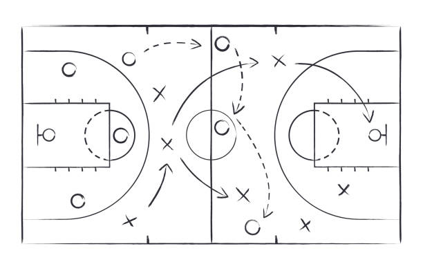

<!DOCTYPE html>
<html lang="en">
<head>
  <meta charset="UTF-8">
  <title>Reglas Básicas</title>
  
</head>
<body>
 <h2 style="display: inline-block;border:1px solid lightgray;">Reglas Básicas</h2>
 
Duración: Generalmente se juega en cuatro periodos de 10 o 12 minutos (dependiendo de la liga), con pausas entre ellos.
    Objetivo: Anotar puntos lanzando el balón a través de la canasta del equipo contrario.
    Puntuación:
     - Una canasta dentro del área de 3 puntos otorga 2 puntos.
     - Los tiros desde fuera de esa área valen 3 puntos.
     - Los tiros libres, otorgados por faltas, valen 1 punto.
    Dribbling: Los jugadores deben botar el balón mientras avanzan con él. No se puede correr con el balón en las manos sin botarlo.
    Equipos: Cada equipo tiene 5 jugadores en la cancha y puede hacer sustituciones.
    Canasta: La canasta está a una altura de 3,05 metros (10 pies) del suelo.

 
 <iframe width="560" height="315" src="https://www.youtube.com/embed/gSHkq9dgNIQ?si=hwJHPuKp2p0xr4aB" title="YouTube video player" frameborder="0" allow="accelerometer; autoplay; clipboard-write; encrypted-media; gyroscope; picture-in-picture; web-share" referrerpolicy="strict-origin-when-cross-origin" allowfullscreen></iframe>
  
  <a href="Baloncesto.html">
Baloncesto
</a>
  <a href="Historia.html">
Historia
</a>
</body>
</html>
